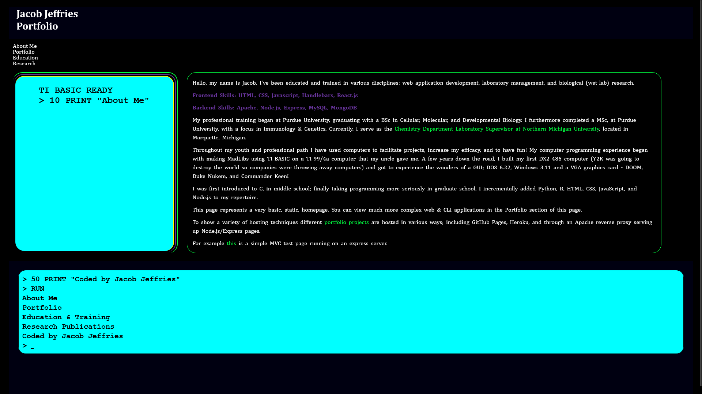

# Personal Portfolio - In ReactJS

## Description 
This is a dynamic page generated using HTML, CSS, JavaScript, and ReactJS. Unlike the earlier portfolio page I created, this one renders different content on the page without reloading and has a Reactjs form with email validation. 

## Installation
This is a delpoyed site and does not require installation. You can visit the site on GitHub Pages:

https://jacob-jeffries.github.io/portfolio/

## Usage
This is a simple ReactJS web application with a few navigation links at the top, click each link to load the relevent content on the page. 

1. The page loads on the About Me content
2. Click on the Portfolio link to see a Carousel of my previous work
3. Click on the Education link to see my education
4. Click on the Research link to see my published research
5. Click on the Contact Me link to render a fillable form
6. Click on the Resume link to download a copy of my current resume

## Credits 
This Web Application was coded by Jacob Jeffries. 

Built to GitHub Pages using instruction found here: 
https://github.com/gitname/react-gh-pages

Client:
*   React 17.0.2
*   React-Dom 17.0.2
*   React-scripts 5.0.1
*   Bootstrap 5.2.3
*   Axios 1.3.5

Server:
*   cors 2.8.5
*   dotenv 8.2.0
*   express 4.17.1
*   nodemon 2.0.4

Root:
*   node 18.14.0
*   npm 9.3.1
*   concurrently 5.2.0

